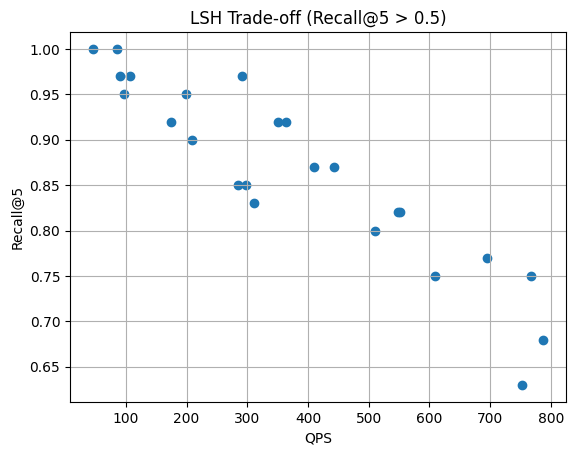
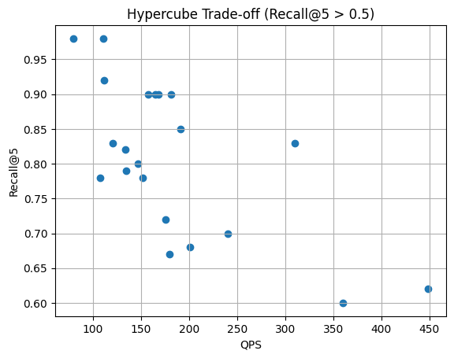

# Classic ANN Algorithms Performance on Proteins Dataset

This report includes the testings that occured using the Classic Approximate-Nearest-Neighbors Algorithms on the proteins' embeddings generated by ESM2 model.  
The purpose of this report is the extraction of the best set of parameters to be used for each algorithm, in order to achieve better results on the final mission: Searching for proteins remote Homologs.  
For the experiments for the best hyperparameters, we used random search based on our previous experience on SIFT and MNIST datasets.


## LSH 
| k  | L  | w   | Recall@5  | QPS         | tApprox (ms) | tTrue (ms) |
| -- | -- | --- | --------- | ----------- | ------------ | ---------- |
| 6  | 14 | 6.0 | **1.000** | 86.16       | 11.61        | 8.60       |
| 6  | 14 | 3.0 | 0.683     | 787.91      | 1.27         | 9.97       |
| 6  | 14 | 4.0 | 0.850     | 298.63      | 3.35         | 8.81       |
| 6  | 12 | 4.0 | 0.833     | 311.12      | 3.21         | 10.41      |
| 4  | 12 | 4.0 | **0.967** | 89.62       | 11.16        | 9.39       |
| 8  | 12 | 4.0 | 0.633     | 752.65      | 1.33         | 8.61       |
| 3  | 12 | 3.0 | **0.967** | 106.78      | 9.37         | 8.83       |
| 8  | 14 | 3.0 | 0.550     | **2863.40** | **0.35**     | 8.64       |
| 8  | 14 | 4.0 | 0.767     | 695.09      | 1.44         | 8.58       |
| 8  | 14 | 5.0 | 0.850     | 284.15      | 3.52         | 9.86       |
| 10 | 14 | 5.0 | 0.750     | 767.15      | 1.30         | 9.12       |
| 10 | 16 | 5.0 | 0.800     | 509.97      | 1.96         | 10.60      |
| 10 | 18 | 5.0 | 0.817     | 548.84      | 1.82         | 7.97       |
| 10 | 18 | 5.5 | **0.917** | 363.82      | 2.75         | 7.94       |
| 10 | 22 | 5.5 | **0.967** | 291.59      | 3.43         | 10.23      |
| 10 | 22 | 5.0 | 0.867     | 443.29      | 2.26         | 9.37       |
| 5  | 22 | 5.0 | **1.000** | 45.25       | 22.10        | 8.81       |
| 8  | 22 | 5.0 | 0.900     | 208.51      | 4.80         | 8.60       |
| 12 | 22 | 6.0 | 0.867     | 410.46      | 2.44         | 9.30       |
| 10 | 20 | 5.5 | **0.917** | 350.62      | 2.85         | 8.71       |
| 4  | 20 | 3.0 | 0.950     | 97.65       | 10.24        | 10.54      |
| 6  | 22 | 3.0 | 0.750     | 375.66      | 2.66         | 9.88       |
| 6  | 20 | 3.0 | 0.750     | 609.66      | 1.64         | 8.78       |
| 6  | 20 | 4.0 | 0.950     | 199.50      | 5.01         | 7.70       |
| 6  | 18 | 4.0 | 0.917     | 174.35      | 5.74         | 10.99      |
| 8  | 20 | 4.0 | 0.817     | 551.08      | 1.81         | 7.68       |




Balanced configuration:
```
k = 10, L = 18, w = 5.5
Recall@5 = 0.917
QPS ≈ 364
```

## Hypercube

| kproj |    w |  M | probes |  N |     Recall@N |     QPS | tApprox (ms) | tTrue (ms) |
| ----: | ---: | -: | -----: | -: | -----------: | ------: | -----------: | ---------: |
|    10 | 12.0 | 20 |     10 |  4 |     0.833333 | 120.232 |        8.317 |      8.667 | 
|    10 | 12.0 | 20 |      4 |  4 |     0.791667 | 134.929 |        7.411 |      8.851 | 
|    10 | 12.0 | 20 |      4 |  5 |     0.800000 | 146.469 |        6.827 |      8.204 | 
|    10 | 12.0 | 20 |      2 |  5 |     0.666667 | 179.299 |        5.577 |      8.005 | 
|    12 | 10.0 | 20 |      4 |  5 |     0.783333 | 107.492 |        9.303 |     12.590 | 
|    12 |  4.0 | 20 |      4 |  5 |     0.316667 | 561.567 |        1.781 |     10.789 | 
|    18 |  4.0 | 20 |      4 |  5 |     0.166667 | 4097.57 |        0.244 |     10.162 | 
|     8 |  4.0 | 20 |      4 |  5 |     0.683333 | 201.121 |        4.972 |      9.259 | 
|    14 |  7.0 | 20 |      4 |  5 |     0.700000 | 240.278 |        4.162 |      7.735 | 
|    14 |  7.0 | 10 |      4 |  5 |     0.700000 | 235.550 |        4.245 |      8.365 | 
|    14 |  7.0 | 20 |      8 |  5 |     0.716667 | 175.378 |        5.702 |      9.655 | 
|    14 | 10.0 | 20 |      4 |  5 |     0.783333 | 152.150 |        6.572 |      9.276 | 
|    14 | 20.0 | 20 |      4 |  5 | **0.983333** | 110.546 |        9.046 |      8.926 | 
|    18 | 20.0 | 20 |      4 |  5 |     0.900000 | 181.438 |        5.512 |      8.287 | 
|    20 | 20.0 | 20 |      4 |  5 |     0.900000 | 168.214 |        5.945 |      8.815 | 
|    16 | 20.0 | 20 |      4 |  5 |     0.900000 | 164.532 |        6.078 |      8.750 | 
|    18 | 20.0 | 40 |      4 |  5 |     0.900000 | 157.149 |        6.363 |      9.377 | 
|    18 | 20.0 | 10 |      4 |  5 |     0.900000 | 148.826 |        6.719 |     11.157 | 
|    18 | 10.0 | 10 |      4 |  5 |     0.600000 | 359.858 |        2.779 |     10.319 | 
|    18 | 10.0 | 10 |     10 |  5 |     0.616667 | 448.998 |        2.227 |      9.341 | 
|    18 | 10.0 | 10 |     20 |  5 |     0.833333 | 310.075 |        3.225 |      7.720 | 
|    18 |  8.0 | 10 |     20 |  5 |     0.683333 | 286.407 |        3.492 |      8.241 | 
|    18 | 12.0 | 10 |     25 |  5 |     0.816667 | 133.316 |        7.501 |      8.535 | 
|    18 | 12.0 | 10 |     20 |  5 |     0.683333 | 193.665 |        5.164 |      8.633 | 
|    18 |  8.0 | 10 |     20 |  5 |     0.683333 | 306.637 |        3.261 |      8.584 | 
|    18 | 10.0 | 10 |     22 |  5 |     0.850000 | 190.852 |        5.240 |     10.237 | 
|    14 | 10.0 | 10 |     22 |  5 | **0.983333** | 79.2325 |       12.621 |     11.191 | 
|    14 | 10.0 | 10 |     14 |  5 |     0.783333 | 91.6207 |       10.915 |     11.537 | 
|    18 | 10.0 | 10 |     20 |  5 |     0.833333 | 286.154 |        3.495 |      9.084 | 
|    12 |  6.0 | 10 |     20 |  5 | **0.916667** | 111.200 |        8.993 |      7.895 | 



Balanced configuration:
```
kproj=18, w=10, M=10, probes=20
Recall@5 = 0.8333
QPS ≈ 310
```